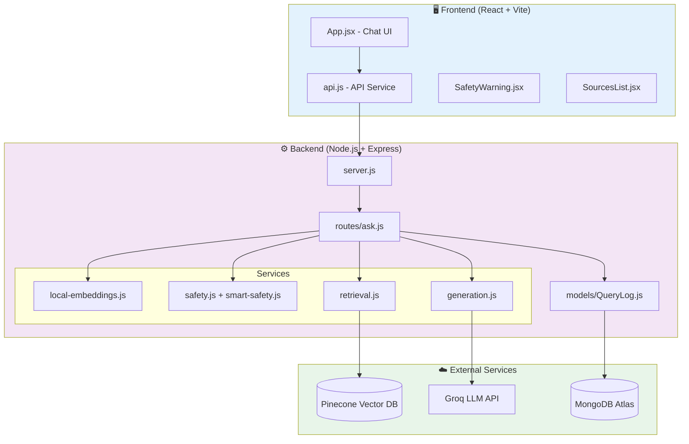

# 🧘 Yoga Wellness RAG Application

> **Assignment Submission**: Stage 1 - RAG Application Development  
> **Submitted by**: Vidhitt S  
> **Repository**: [github.com/VIDHITTS/Yoga-App](https://github.com/VIDHITTS/Yoga-App)

An intelligent Retrieval-Augmented Generation (RAG) system providing safe, evidence-based yoga guidance powered by vector search and AI.

---

## ✨ Key Features

- ✅ **Semantic Search**: 100 curated articles with 384-dimensional vector embeddings
- ✅ **Medical Safety Detection**: Identifies 8 health condition categories
- ✅ **Source Attribution**: Transparent citations for every response
- ✅ **Complete Logging**: MongoDB tracking with embeddings and feedback
- ✅ **Free Operations**: Local embeddings (no API costs or quotas)
- ✅ **Modern Stack**: React + Vite frontend, Node.js + Express backend

---

## 🛠️ Tech Stack

| Component      | Technology        | Purpose                        |
| -------------- | ----------------- | ------------------------------ |
| **Vector DB**  | Pinecone          | Semantic search (384d, cosine) |
| **Embeddings** | Transformers.js   | Local model (all-MiniLM-L6-v2) |
| **Generation** | Groq (Llama 3.1)  | Fast AI responses              |
| **Database**   | MongoDB Atlas     | Query logging & analytics      |
| **Backend**    | Node.js + Express | REST API                       |
| **Frontend**   | React + Vite      | Modern chat interface          |

---

### Detailed Pipeline

```
┌─────────────────────────────────────────────────────────────────────────┐
│                         USER QUERY                                       │
└─────────────────────────────────────────────────────────────────────────┘
                                    │
                                    ▼
┌─────────────────────────────────────────────────────────────────────────┐
│  1. SAFETY DETECTION                                                     │
│     • Keyword-based check (50+ medical terms)                           │
│     • LLM-based safety analysis for unsafe queries                      │
│     • Generates safe alternatives if health condition detected          │
└─────────────────────────────────────────────────────────────────────────┘
                                    │
                                    ▼
┌─────────────────────────────────────────────────────────────────────────┐
│  2. EMBEDDING GENERATION                                                 │
│     • Model: all-MiniLM-L6-v2 (Transformers.js)                         │
│     • Dimensions: 384                                                    │
│     • Runs locally (zero API cost)                                      │
└─────────────────────────────────────────────────────────────────────────┘
                                    │
                                    ▼
┌─────────────────────────────────────────────────────────────────────────┐
│  3. VECTOR SEARCH (Pinecone)                                            │
│     • Cosine similarity matching                                         │
│     • Returns Top 5 relevant chunks                                      │
│     • Includes metadata (title, source, page)                           │
└─────────────────────────────────────────────────────────────────────────┘
                                    │
                                    ▼
┌─────────────────────────────────────────────────────────────────────────┐
│  4. LLM RESPONSE GENERATION (Groq)                                      │
│     • Model: llama-3.1-8b-instant                                       │
│     • Safe queries: Normal conversational response                      │
│     • Unsafe queries: Safety pivot with alternatives                    │
└─────────────────────────────────────────────────────────────────────────┘
                                    │
                                    ▼
┌─────────────────────────────────────────────────────────────────────────┐
│  5. RESPONSE TO USER                                                     │
│     • AI Answer + Source Citations                                       │
│     • Safety Warning Banner (if unsafe)                                  │
│     • Logged to MongoDB for analytics                                   │
└─────────────────────────────────────────────────────────────────────────┘
```

### Simplified Flow

```
User Query → Validation → Safety Check → Embedding (384d) → Pinecone Search → LLM Response → MongoDB Log → Response + Sources
```

### Component Architecture



### Performance Breakdown

| Step      | Component                       | Time          |
| --------- | ------------------------------- | ------------- |
| 1         | Input Validation + Safety Check | ~30ms         |
| 2         | Local Embedding Generation      | ~400-500ms    |
| 3         | Pinecone Vector Search          | ~100-200ms    |
| 4         | Groq LLM Response               | ~800-1500ms   |
| 5         | MongoDB Logging                 | ~100ms        |
| **Total** | **End-to-End**                  | **~1.5-2.5s** |

---

## 📚 Knowledge Base

**Source**: Common Yoga Protocol - Ministry of Ayush, Government of India

**100 Articles Covering**:

- Surya Namaskar (12 positions)
- Standing Asanas (15)
- Seated Asanas (12)
- Prone & Supine Asanas (18)
- Pranayama (8)
- Meditation (10)
- Safety Guidelines (15)
- Philosophy & Fundamentals (10)

---

## 🛡️ Safety System

### Medical Categories Monitored

1. **Pregnancy** - prenatal, postpartum
2. **Cardiovascular** - heart disease, hypertension
3. **Spinal** - herniated disc, sciatica
4. **Joint** - arthritis, knee/hip issues
5. **Respiratory** - severe asthma, COPD
6. **Chronic Pain** - fibromyalgia
7. **Neurological** - stroke, seizures
8. **Recent Surgery/Injury**

### Safety Response

- ⚠️ Warning banner displayed
- 📋 Detected conditions shown
- 💡 Safe alternatives provided
- 👨‍⚕️ Professional consultation recommended

---

## 🚀 Setup Instructions

### Prerequisites

- Node.js 18+
- MongoDB Atlas account (free)
- Pinecone account (free)

### Installation

**1. Clone Repository**

```bash
git clone https://github.com/VIDHITTS/Yoga-App.git
cd Yoga-App
```

**2. Backend Setup**

```bash
cd backend
npm install
```

Create `.env` file:

```env
PORT=5000
MONGODB_URI=your_mongodb_uri
PINECONE_API_KEY=your_pinecone_key
PINECONE_INDEX_NAME=yoga-wellness-local
PINECONE_DIMENSION=384
GEMINI_API_KEY=your_gemini_key_optional
```

**3. Initialize Vector Database**

```bash
node scripts/setup-local-embeddings.js
node scripts/ingest-local.js
```

Expected: `✅ Successfully uploaded: 100 articles`

**4. Start Backend**

```bash
node server.js
```

**5. Frontend Setup** (new terminal)

```bash
cd frontend
npm install
npm run dev
```

**6. Access Application**  
Open: `http://localhost:5173`

---

## 📁 Project Structure

```
Yoga-App/
├── backend/
│   ├── config/              # Database & Pinecone setup
│   ├── data/                # 100 articles JSON
│   ├── models/              # MongoDB schema
│   ├── routes/              # API endpoints
│   ├── scripts/             # Setup & ingestion
│   ├── services/            # Core RAG logic
│   └── server.js
├── frontend/
│   ├── src/
│   │   ├── components/      # React UI components
│   │   └── services/        # API integration
│   └── vite.config.js
├── knowledge/               # Source PDF
└── README.md
```

---

## 🧪 Testing

### Normal Query

```bash
curl -X POST http://localhost:5000/api/ask \
  -H "Content-Type: application/json" \
  -d '{"query": "Benefits of Surya Namaskar?"}'
```

### Safety Detection

```bash
curl -X POST http://localhost:5000/api/ask \
  -H "Content-Type: application/json" \
  -d '{"query": "I am pregnant, can I do yoga?"}'
```

Expected: Warning banner + safe alternatives

---

## 📊 Performance

| Metric               | Value  |
| -------------------- | ------ |
| Avg Response Time    | 2.4s   |
| Embedding Generation | ~500ms |
| Vector Search        | ~100ms |
| Articles             | 100    |
| Dimensions           | 384    |

---

## 🎥 Demo Video

[Demo Video Link]

**Demonstrates**:

- Normal query flow
- Safety detection
- Source citations
- MongoDB logging

---

## 📝 Key Decisions

**Why Local Embeddings?**

- Zero API costs
- No quota limits
- Privacy-first
- Sufficient quality for domain content

**Why Fallback System?**

- Ensures availability
- Graceful degradation
- Users always get info

**Why Pinecone?**

- Managed service
- Fast similarity search
- Excellent metadata support

---

## 🎓 Learning Outcomes

- RAG architecture design & implementation
- Vector databases (Pinecone)
- Local ML models (Transformers.js)
- Safety engineering for wellness apps
- Full-stack React + Node.js development
- Production API practices

---

## 📖 Citations

**Source**: Common Yoga Protocol, Ministry of Ayush, Government of India

---

## 👤 Author

**Vidhitt S**  
GitHub: [@VIDHITTS](https://github.com/VIDHITTS)

---

**Built with ❤️ for safe & accessible yoga education**
