# 🔄 RAG Pipeline Flow Documentation

This document explains the complete request-to-response flow of the Yoga Wellness RAG Application.

---

## 📊 Complete Flow Diagram

```mermaid
flowchart TD
    A[👤 User Query] --> B{Input Validation}
    B -->|Invalid| C[❌ 400 Error Response]
    B -->|Valid| D[🛡️ Safety Detection]

    D --> E{Contains Health Keywords?}
    E -->|Yes - Unsafe| F[🚨 Flag as Unsafe]
    E -->|No - Safe| G[Check Yoga Relevance]

    F --> H[🤖 Smart Safety LLM Check]
    H --> I[Generate Safety Analysis]

    G --> J{Is Yoga Related?}
    J -->|No| K[📝 Rejection Message]
    K --> L[Log to MongoDB]
    L --> M[Return Rejection Response]

    J -->|Yes| N[🔢 Generate Embedding]
    I --> N

    N --> O[Transformers.js<br/>all-MiniLM-L6-v2<br/>384 dimensions]
    O --> P[📚 Pinecone Vector Search]

    P --> Q[Cosine Similarity<br/>Top 5 Matches]
    Q --> R[Retrieved Context Chunks]

    R --> S{Is Query Unsafe?}
    S -->|Yes| T[🛡️ Generate Safety Pivot Response]
    S -->|No| U[🤖 Generate Normal Response]

    T --> V[Groq LLM<br/>llama-3.1-8b-instant]
    U --> V

    V --> W[AI Generated Answer]
    W --> X[📊 Prepare Response]

    X --> Y[Add Sources with Scores]
    Y --> Z[Add Safety Info if Unsafe]
    Z --> AA[💾 Log to MongoDB]

    AA --> BB[📤 JSON Response to Client]

    BB --> CC{Frontend Display}
    CC -->|Unsafe| DD[🔴 Red Safety Banner<br/>+ Doctor Consultation Advice<br/>+ Safe Alternatives]
    CC -->|Safe| EE[💬 Normal Response<br/>+ Source Citations]

    style A fill:#e1f5fe
    style D fill:#fff3e0
    style F fill:#ffebee
    style N fill:#e8f5e9
    style P fill:#f3e5f5
    style V fill:#fff8e1
    style BB fill:#e8f5e9
    style DD fill:#ffcdd2
    style EE fill:#c8e6c9
```

---

## 🔍 Detailed Step-by-Step Flow

### Phase 1: Request Validation

### Phase 2: Safety Detection

### Phase 3: Embedding & Retrieval

### Phase 4: Response Generation

### Phase 5: Logging & Response

---

## 📁 Component Architecture

---

## ⏱️ Performance Timeline

---

## 🔐 Safety System Flow

```mermaid
flowchart LR
    subgraph Detection["🔍 Detection Layer"]
        K1[Pregnancy Keywords]
        K2[Cardiovascular]
        K3[Musculoskeletal]
        K4[Chronic Diseases]
        K5[Neurological]
        K6[Cancer]
        K7[Respiratory]
        K8[Recent Trauma]
    end

    subgraph Analysis["🧠 Smart Analysis"]
        LLM[Groq LLM Analysis]
        Risk[Risk Assessment]
        Alt[Safe Alternative Generation]
    end

    subgraph Response["📤 Response"]
        Banner[🔴 Safety Banner]
        Consult[👨‍⚕️ Doctor Consultation Advice]
        Alts[💡 Safe Alternatives]
        Answer[Modified AI Response]
    end

    K1 & K2 & K3 & K4 & K5 & K6 & K7 & K8 --> LLM
    LLM --> Risk
    Risk --> Alt
    Alt --> Banner
    Banner --> Consult
    Consult --> Alts
    Alts --> Answer

    style Detection fill:#ffebee
    style Analysis fill:#fff3e0
    style Response fill:#e8f5e9
```

---

## 📊 Data Flow Summary

| Step | Component        | Input            | Output          | Time        |
| ---- | ---------------- | ---------------- | --------------- | ----------- |
| 1    | Express Router   | HTTP POST        | Validated query | ~10ms       |
| 2    | Safety Service   | Query string     | Safety flags    | ~20ms       |
| 3    | Local Embeddings | Query string     | 384-dim vector  | ~400-500ms  |
| 4    | Pinecone         | Embedding vector | Top 5 chunks    | ~100-200ms  |
| 5    | Groq LLM         | Context + Query  | AI response     | ~800-1500ms |
| 6    | MongoDB          | Full query data  | Logged document | ~100ms      |
| 7    | Express          | Response object  | JSON to client  | ~10ms       |

**Total: ~1.5-2.5 seconds per query**

---

## 🎯 Key Design Decisions

1. **Local Embeddings**: Zero API cost, no quota limits
2. **Smart Safety**: LLM-powered risk analysis, not just keywords
3. **Fallback System**: Template responses when AI fails
4. **Complete Logging**: Every query tracked for analytics
5. **Source Attribution**: Transparent citations for trust

---

_Generated for Yoga Wellness RAG Application - Assignment Submission_
